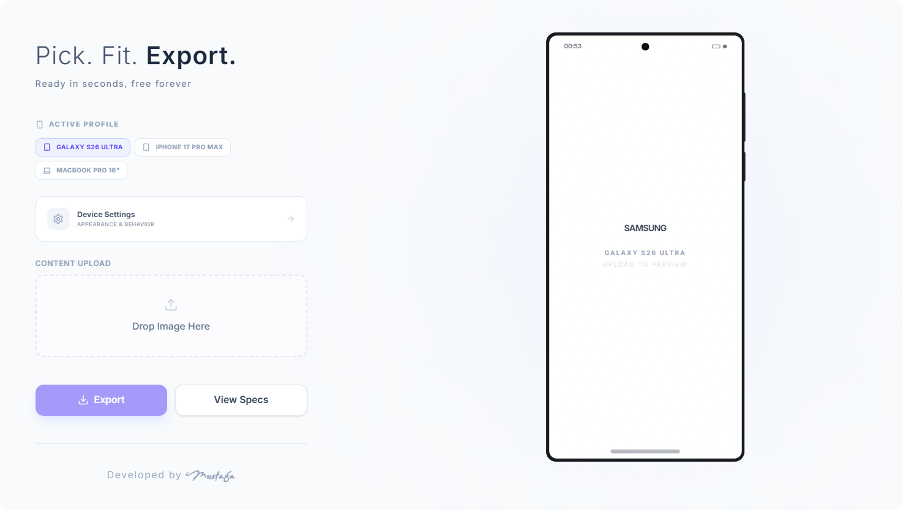

# 📱 Mockup Studio

### Premium Device Frame Configurator by **Mustafa**

  <em>
    Live preview of the application interface — 
    <a href="https://mwh-mockup-studio.vercel.app" target="_blank">🚀 View Live Demo</a>
  </em>

**Mockup Studio** helps developers and designers showcase their UI inside high-quality device frames — fast, simple, and beautiful.

---

## ✨ Key Features

- **🎯 Precision Framing**: Support for latest devices including iPhone 17 Pro Max, Galaxy S26 Ultra, and MacBook Pro 16".
- **🎨 Dynamic Themes**: Seamlessly switch between Light and Dark modes for all device frames.
- **🛡️ Safe Area Awareness**: Toggle system UI elements (notch/punch-hole) and content padding for pixel-perfect alignment.
- **🖱️ Advanced Interactions**:
  - **Drag & Fit**: Move your content within the frame to find the perfect crop.
  - **Drag Mode (Mobile)**: Dedicated lock/unlock toggle to ensure smooth page navigation vs. precise image positioning.
  - **Smart Reset**: Double-tap on the preview to reset position instantly.
  - **Seamless Drag & Drop**: Replace existing screenshots by simply dropping a new file over the uploader.
- **⏰ Real-time Experience**: Integrated system clock in mobile frames that syncs with your local time.
- **🕹️ Realistic Details**: High-fidelity physical buttons (Power/Volume) and base structures for a premium look.
- **📸 High-Res Export**: Download 4x resolution PNGs.

## 📖 Usage

1. **Pick a Device**: Select from the top profiles (Samsung, iPhone, MacBook).
2. **Upload Content**: Drag and drop your screenshot into the uploader (now supports quick replacement).
3. **Adjust Fit**:
   - **Zoom**: Use the slider to scale your image.
   - **Position**: Drag the image inside the frame.
   - **Mobile Users**: Use the **Drag Mode** toggle in the sidebar to unlock image movement.
4. **Export**: Hit the **Download Mockup** button to save your masterpiece.

---

Developed with ❤️ by <b>Mustafa</b>

